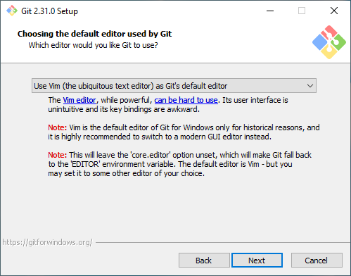

# EqualStreetNames : Install & Run locally

## Table of content

- [Requirements](#Requirements)
- [Setting up](#Setting-up)
- [Run website locally](#Website)
- [Run data update process locally](#Data-update-process)

## Install

This guide tries to go through some of the requirements for developing on this project, but feel free to adopt it to your own needs.

### Requirements

- Git: [Linux](https://git-scm.com/download/linux) or [Windows](https://git-scm.com/download/win)
- Node.js: [Linux](https://nodejs.org/en/download/) or [Windows](https://nodejs.org/en/download/)
- PHP: [Linux](https://www.php.net/manual/en/install.unix.php) or [Windows](https://www.php.net/manual/en/install.windows.php)
- [Composer](https://getcomposer.org/download/)
- [Windows Terminal](https://www.microsoft.com/en-us/p/windows-terminal/9n0dx20hk701) (optional, and for Windows only)
- A text editor of your choice

#### PHP

Only PHP CLI (Command Line Interface) is required ; no need for a web-sver (like *Apache* or *nginx*).

#### Git (Windows)

Git installation is quite straightforward, and can also be replaced by installing a [Git GUI](https://git-scm.com/download/gui/windows),
or a text editor that has Git built-in like [Visual Studio Code](https://code.visualstudio.com/).
If you choose to install GIT standalone, you can leave most options to default,
but it might be worth to change the editor config to an editor you prefer on this screen:



### Setting up

Getting a working version of EqualStreetNames consists of a couple of steps:

1. Clone the repository

    ```cmd
    git clone https://github.com/EqualStreetNames/equalstreetnames.git
    ```

1. Go to the folder

    ```cmd
    cd equalstreetnames
    ```

1. Initialize and download city submodules

    ```cmd
    git submodule update --init --recursive
    ```

1. Install JavaScript dependencies with `npm` (command to run in `website/` directory)  
**Required if you want to run the website locally**

    ```cmd
    npm install
    ```

1. Install PHP dependencies with `composer` (command to run in `process/` directory)  
**Required if you want to run the data update process locally**

    ```cmd
    composer install
    ```

You should now have a completely working version of EqualStreetNames to work on.

## Run Locally

### Website

1. Choose the city you want to run locally (command to run in `website/` directory)

    ```cmd
    npm run build:country:city -- --serve
    ```

    Example for Brussels, Belgium: `npm run build:belgium:brussels -- --serve`

1. Once installed and running, go to <http://localhost:1234/>

### Data update process

1. Choose the city you want to update locally (command to run in `process/` directory)

    ```cmd
    composer run update-data -- --city=country/city
    ```

    Example for Brussels, Belgium: `composer run update-data -- --city=belgium/brussels`
