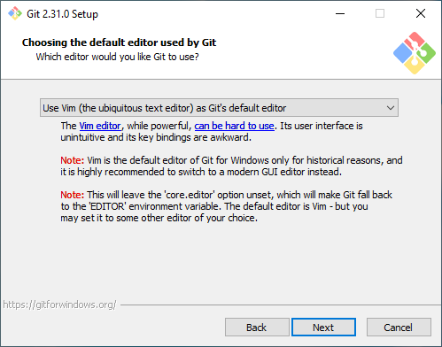

# Setting up a development environment on Windows

This guide tries to go through some of the requirements for developing on this project,
but feel free to adopt it to your own needs.

## Requirements

* [Git](https://git-scm.com/download/win)
* [Node.js](https://nodejs.org/en/download/)
* [PHP](https://www.php.net/manual/en/install.windows.php)
* [Composer](https://getcomposer.org/download/)
* [Windows Terminal (optional)](https://www.microsoft.com/en-us/p/windows-terminal/9n0dx20hk701)
* An editor of your choice

### Git

Git installation is quite straightforward, and can also be replaced by installing a [Git GUI](https://git-scm.com/download/gui/windows),
or an editor that has Git built-in like [Visual Studio Code](https://code.visualstudio.com/).
If you choose to install GIT standalone, you can leave most options to default,
but it might be worth to change the editor config to an editor you prefer on this screen:

### Node.js

[Node.js](https://nodejs.org/en/download/) can be installed completely with standard settings.

### PHP

PHP can be installed in multiple ways:
The first, and probably easiest way is to use the PHP included in a program like [XAMPP](https://www.apachefriends.org/download.html).
Alternatively you can download [PHP](https://windows.php.net/download), put it in a folder and add that to your PATH.

### Composer

Composer can be installed completely with standard settings.
If it doesn't detect PHP you might need to select the PHP exe file from Xampp or PHP

### Windows Terminal (optional)

The Windows Terminal can be installed from the [Microsoft Store](https://www.microsoft.com/en-us/p/windows-terminal/9n0dx20hk701).

## Setting up

Getting a working version of EqualStreetNames consists of a couple of steps:

1. Clone the repository
`git clone https://github.com/EqualStreetNames/equalstreetnames.git`

2. Go to the folder
`cd equalstreetnames`

3. Initialize submodules
`git submodule update --init --recursive`

4. Install with npm
`npm install`

5. Install with composer
`composer install`

You should now have a completely working version of EqualStreetNames to work on.

## Starting up a server

You can start up a server using `npm run server:myCountry:myCity`,
where you replace myCountry by an available country (for example 'belgium'),
and myCity by an available city (for example 'brussels').
